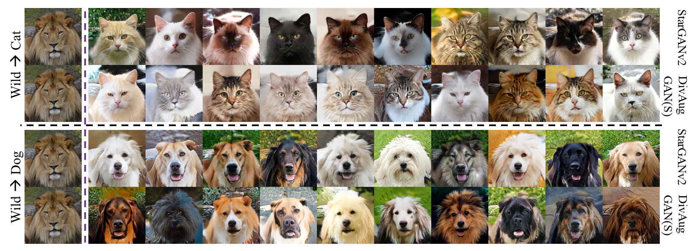
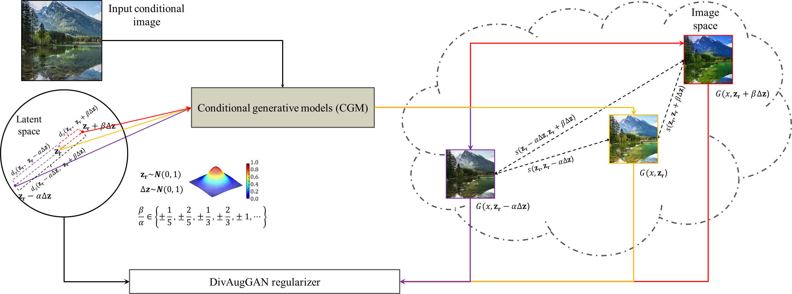
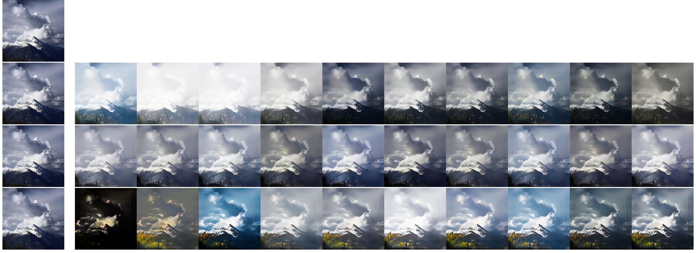
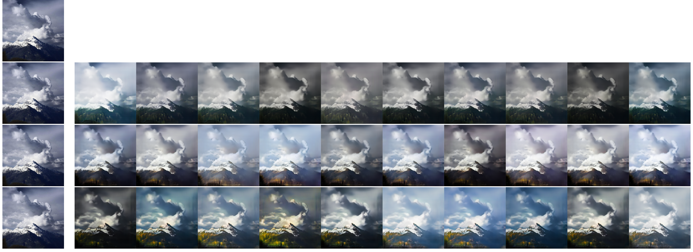
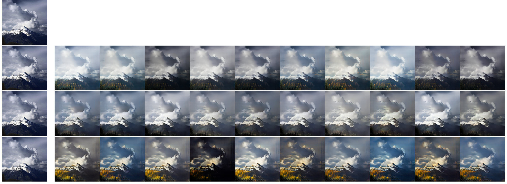
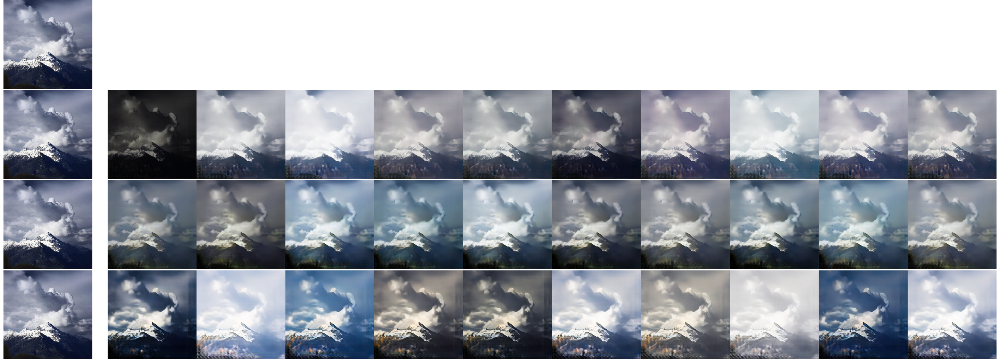

#  DivAugGAN 

     
 
     

   

We provide our PyTorch implementation of DivAugGAN for multimodal image-to-image translation. DivAugGAN functions as a regularizer to simultaneously maximize the distinction of the generating samples and maintain the relative variation consistency in the translation process as well.　 　

##  Example Results 

###  Two-domain paired image-to-image translation   
  **Aeriel  &rarr;  Map**     

    

    

    

<!--   -->

 Qualitative diversity comparisons of DivAugGAN (fifth row) with *vanilla* BicycleGAN (first row), MSGAN (second row), DSGAN (third row), and DivCoBicycleGAN (fourth row) on  **Aeriel &rarr;  Maps**  dataset. The first column shows the input images and the remaining 10 columns presents the generated multimodal images with 10 different input latent vectors for this paired multimodal image-to-image translation. DivAugGAN generates images with superior contents preservation and adequate variation (diverse color and light) with different input latent vectors.    

###  Two-domain unpaired image-to-image translation qualitative comparisons 

  **Cat  &rarr;  Dog**     

    

    

 Qualitative diversity comparisons of DivAugGAN (fifth row) with DRIT (first row), MSGAN (second row), DSGAN (third row), and DivCo (fourth row) on **Cat  &rarr;  Dog**. The first column shows the input images and the remaining 10 columns presents the generated multimodal images with 10 different input latent vectors for this unpaired multimodal image-toimage translation. DivAugGAN generates images with promising content preservation performance (cloud shape) and adequate variation (diverse color and light) for the different input latent vectors.     

  **Dog  &rarr; Cat**    

    

    

 Qualitative diversity comparisons of DivAugGAN (fifth row) with DRIT (first row), MSGAN (second row), DSGAN (third row), and DivCo (fourth row) on **Dog  &rarr; Cat**. The first column shows the input images and the remaining 10 columns presents the generated multimodal images with 10 different input latent vectors for this unpaired multimodal image-toimage translation. DivAugGAN generates images with promising content preservation performance (cloud shape) and adequate variation (diverse color and light) for the different input latent vectors.     

  **Monet  &rarr; Photo**     

    

    

 Qualitative diversity comparisons of DivAugGAN (fifth row) with DRIT (first row), MSGAN (second row), DSGAN (third row), and DivCo (fourth row) on **Monet  &rarr; Photo**. The first column shows the input images and the remaining 10 columns presents the generated multimodal images with 10 different input latent vectors for this unpaired multimodal image-toimage translation. DivAugGAN generates images with promising content preservation performance (cloud shape) and adequate variation (diverse color and light) for the different input latent vectors.     

 Quantitative comparisons of DivAugGAN with DRIT, MSGAN, DSGAN, and DivCo on **Monet  &rarr; Photo**.   

| Methods   | FID &darr; | LPIPS &uarr; |  Precision &uarr;  |  Recall &uarr; |   Density &uarr; | Coverage &uarr; |
|-----------|:----------:|--------------|:------------------:|:--------------:|:----------------:|:---------------:|
| DRIT      |   78.73    |    0.197     |       0.664        |     0.028      |       0.555      |      0.162      |
| MSGAN     |   **68.21**    |    **0.280**     |       <u>0.712</u>        |     **0.062**      |       **0.754**      |      **0.255**      |
| DSGAN     |   79.45    |    0.182     |       0.576        |     0.025      |       0.429      |      0.145      |
| DivCo     |   72.44    |    0.244     |       **0.726**        |     0.029      |       <u>0.673</u>      |      <u>0.233<u>      |
| DivAugGAN |   <u>70.51</u>    |    <u>0.236</u>     |       0.690        |     <u>0.044</u>      |       0.566      |      0.213      |

  **Photo  &rarr; Monet**     

    

    

 Qualitative diversity comparisons of DivAugGAN (fifth row) with DRIT (first row), MSGAN (second row), DSGAN (third row), and DivCo (fourth row) on **Photo  &rarr; Monet**. The first column shows the input images and the remaining 10 columns presents the generated multimodal images with 10 different input latent vectors for this unpaired multimodal image-toimage translation. DivAugGAN generates images with promising content preservation performance (cloud shape) and adequate variation (diverse color and light) for the different input latent vectors.     

 Quantitative comparisons of DivAugGAN with DRIT, MSGAN, DSGAN, and DivCo on **Photo  &rarr; Monet**.   

| Methods   | FID &darr; | LPIPS &uarr; |  Precision &uarr;  |  Recall &uarr; |   Density &uarr; | Coverage &uarr; |
|-----------|:----------:|--------------|:------------------:|:--------------:|:----------------:|:---------------:|
| DRIT      |   **51.98**    |    0.193     |       **0.623**        |     0.063      |       **0.482**      |      0.854      |
| MSGAN     |   <u>52.16</u>    |    **0.356**     |       <u>0.599</u>        |     **0.209**      |       <u>0.463</u>      |      **0.891**      |
| DSGAN     |   55.98    |    <u>0.321</u>     |       0.596        |     0.142      |       0.456      |      </u>0.857<u>      |
| DivCo     |   55.31    |    0.303     |       0.522        |     0.152      |       0.331      |      0.809      |
| DivAugGAN |   55.58    |    0.306     |       0.548        |     <u>0.157</u>      |       0.413      |      0.820      |
 
 

  **Photograph  &rarr; Portrait**     

    

    

 Qualitative diversity comparisons of DivAugGAN (fifth row) with DRIT (first row), MSGAN (second row), DSGAN (third row), and DivCo (fourth row) on **Photo  &rarr; Portrait**. The first column shows the input images and the remaining 10 columns presents the generated multimodal images with 10 different input latent vectors for this unpaired multimodal image-toimage translation. DivAugGAN generates images with promising content preservation performance (cloud shape) and adequate variation (diverse color and light) for the different input latent vectors.     

 Quantitative comparisons of DivAugGAN with DRIT, MSGAN, DSGAN, and DivCo on **Photograph  &rarr; Portrait**.   

| Methods   | FID &darr; | LPIPS &uarr; |  Precision &uarr;  |  Recall &uarr; |   Density &uarr; | Coverage &uarr; |
|-----------|:----------:|--------------|:------------------:|:--------------:|:----------------:|:---------------:|
| DRIT      |   **49.21**    |    0.401     |       0.761        |     0.174      |       <u>0.938</u>      |      <u>0.295</u>      |
| MSGAN     |   50.43    |    **0.496**     |       0.768        |     **0.216**      |       0.934      |      **0.302**      |
| DSGAN     |   <u>49.86</u>    |    <u>0.474</u>     |       0.768        |     **0.216**      |       0.906      |      0.282      |
| DivCo     |   52.88    |    0.270     |       <u>0.771</u>        |     0.111      |       **0.950**      |      0.273      |
| DivAugGAN |   57.21    |    0.310     |       **0.772**        |     0.182      |       0.754      |      0.225      |
 
 

  **Portrait  &rarr; Photograph**     

    

    

 Qualitative diversity comparisons of DivAugGAN (fifth row) with DRIT (first row), MSGAN (second row), DSGAN (third row), and DivCo (fourth row) on **Portrait  &rarr; Photo**. The first column shows the input images and the remaining 10 columns presents the generated multimodal images with 10 different input latent vectors for this unpaired multimodal image-toimage translation. DivAugGAN generates images with promising content preservation performance (cloud shape) and adequate variation (diverse color and light) for the different input latent vectors.     

 Quantitative comparisons of DivAugGAN with DRIT, MSGAN, DSGAN, and DivCo on **Portrait  &rarr; Photograph**.   

| Methods   | FID &darr; | LPIPS &uarr; |  Precision &uarr;  |  Recall &uarr; |   Density &uarr; | Coverage &uarr; |
|-----------|:----------:|--------------|:------------------:|:--------------:|:----------------:|:---------------:|
| DRIT      |   59.06    |    0.448     |       <u>0.913</u>        |     0.204      |       **1.791**      |      <u>0.819</u>      |
| MSGAN     |   **49.43**    |    <u>0.581</u>     |       **0.945**        |     0.204      |       1.243      |      **0.856**      |
| DSGAN     |   <u>45.32</u>    |    **0.594**     |       0.900        |     **0.260**      |       <u>1.748</u>      |      0.818      |
| DivCo     |   67.71    |    0.237     |       0.796        |     0.093      |       0.940      |      0.564      |
| DivAugGAN |   54.96    |    0.403     |       0.796        |     <u>0.253</u>      |       0.952      |      0.694      |

 

  **Summer  &rarr; Winter**     

    

    

 Qualitative diversity comparisons of DivAugGAN (fifth row) with DRIT (first row), MSGAN (second row), DSGAN (third row), and DivCo (fourth row) on **Summer  &rarr; Winter**. The first column shows the input images and the remaining 10 columns presents the generated multimodal images with 10 different input latent vectors for this unpaired multimodal image-toimage translation. DivAugGAN generates images with promising content preservation performance (cloud shape) and adequate variation (diverse color and light) for the different input latent vectors.     

 Quantitative comparisons of DivAugGAN with DRIT, MSGAN, DSGAN, and DivCo on **Summer  &rarr; Winter**.   

| Methods   | FID &darr; | LPIPS &uarr; |  Precision &uarr;  |  Recall &uarr; |   Density &uarr; | Coverage &uarr; |
|-----------|:----------:|--------------|:------------------:|:--------------:|:----------------:|:---------------:|
| DRIT      |   52.57    |    0.117     |       0.761        |     0.025      |       1.008      |      0.865      |
| MSGAN     |   47.78    |    0.231     |       0.786        |     0.049      |       1.001      |      0.905      |
| DSGAN     |   48.89    |    0.128     |       0.775        |     0.007      |       1.028      |      0.899      |
| DivCo     |   50.82    |    0.097     |       0.751        |     0.001      |       0.948      |      0.843      |
| DivAugGAN |   48.87    |    0.189     |       0.754        |     0.036      |       1.044      |      0.931      |
 

  **Winter  &rarr; Summer**     

    

    

 Qualitative diversity comparisons of DivAugGAN (fifth row) with DRIT (first row), MSGAN (second row), DSGAN (third row), and DivCo (fourth row) on **Winter  &rarr; Summer**. The first column shows the input images and the remaining 10 columns presents the generated multimodal images with 10 different input latent vectors for this unpaired multimodal image-toimage translation. DivAugGAN generates images with promising content preservation performance (cloud shape) and adequate variation (diverse color and light) for the different input latent vectors.     

 Quantitative comparisons of DivAugGAN with DRIT, MSGAN, DSGAN, and DivCo on **Winter  &rarr; Summer**.   

| Methods   | FID &darr; | LPIPS &uarr; |  Precision &uarr;  |  Recall &uarr; |   Density &uarr; | Coverage &uarr; |
|-----------|:----------:|--------------|:------------------:|:--------------:|:----------------:|:---------------:|
| DRIT      |   53.77    |    0.062     |       0.751        |     0.006      |       0.977      |      0.717      |
| MSGAN     |   41.02    |    0.217     |       0.788        |     0.063      |       0.910      |      0.828      |
| DSGAN     |   44.81    |    0.144     |       0.783        |     0.020      |       0.989      |      0.821      |
| DivCo     |   47.58    |    0.125     |       0.755        |     0.016      |       0.782      |      0.757      |
| DivAugGAN |   42.33    |    0.179     |       0.749        |     0.039      |       0.925      |      0.849      |
 

 

###   Multi-domain unpaired image-to-image translation qualitative comparisons 
<!--    -->
<!--     -->

  Alps seasonal transfer    

  Spring  &rarr; Spring     

    

  Spring  &rarr; Summer     

    

  Spring  &rarr; Autumn     

    

  Spring  &rarr; Winter     

    

  Summer  &rarr; Spring     

    

  Summer  &rarr; Summer     

    

  Summer  &rarr; Autumn     

    

  Summer  &rarr; Winter     

    

  Autumn  &rarr; Spring     

    

  Autumn  &rarr; Summer     

    

  Autumn  &rarr; Autumn     

    

  Autumn  &rarr; Winter     

    

  Winter  &rarr; Spring     

    

  Winter  &rarr; Summer     

    

  Winter  &rarr; Autumn     

    

  Winter  &rarr; Winter     

    

  Arts    

  Cezanne  &rarr; Cezanne     

    

  Cezanne  &rarr; Monet     

    

  Cezanne  &rarr; Ukiyoe     

    

  Cezanne  &rarr; Van Gogh     

    

  Cezanne  &rarr; Photo     

    

  Monet  &rarr; Cezanne     

    

  Monet  &rarr; Monet     

    

  Monet  &rarr; Ukiyoe     

    

  Monet  &rarr; Van Gogh     

    

  Monet  &rarr; Photo     

    

  Ukiyoe  &rarr; Cezanne     

    

  Ukiyoe  &rarr; Monet     

    

  Ukiyoe  &rarr; Ukiyoe     

    

  Ukiyoe  &rarr; Van Gogh     

    

  Ukiyoe  &rarr; Photo     

    

  Van Gogh  &rarr; Cezanne     

    

  Van Gogh  &rarr; Monet     

    

  Van Gogh  &rarr; Ukiyoe     

    

  Van Gogh  &rarr; Van Gogh     

    

  Van Gogh  &rarr; Photo     

    

  Photo  &rarr; Cezanne     

    

  Photo  &rarr; Monet     

    

  Photo  &rarr; Ukiyoe     

    

  Photo  &rarr; Van Gogh     

    

  Photo  &rarr; Photo     

    

  AFHQ    

    

 

## Prerequisites
- Linux or macOS
- Python 3
- CPU or NVIDIA GPU + CUDA CuDNN